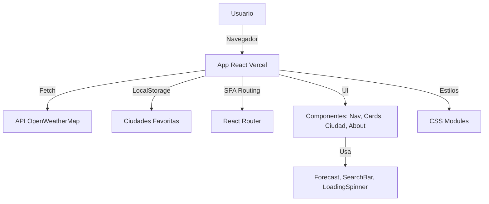
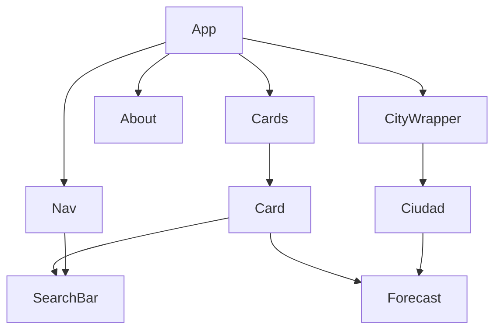
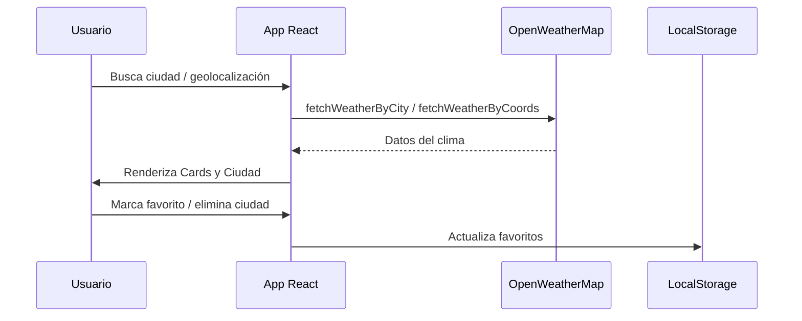
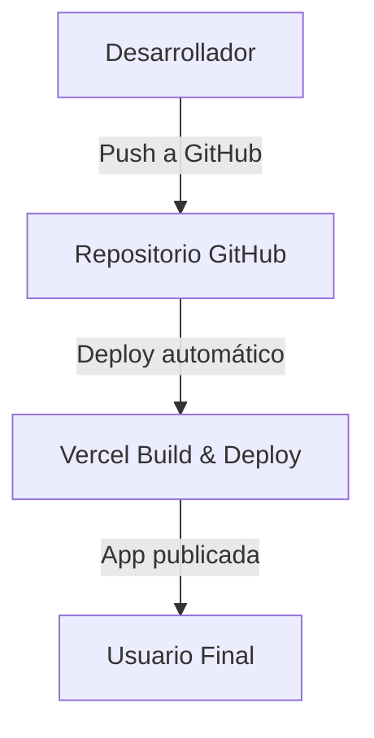

# Clima Mundial

<p align="center">
  
  
  
  
  
  
</p>

Aplicación web moderna para consultar el clima actual de ciudades alrededor del mundo usando la API de OpenWeatherMap.

## Tabla de Contenidos
- [Descripción](#descripción)
- [Características](#características)
- [Instalación](#instalación)
- [Uso](#uso)
- [Estructura del Proyecto](#estructura-del-proyecto)
- [Componentes Principales](#componentes-principales)
- [Dependencias](#dependencias)
- [Desarrollo y Contribución](#desarrollo-y-contribución)

---

## Descripción
Esta aplicación permite buscar ciudades y visualizar información meteorológica relevante como temperatura, clima, viento, nubes y coordenadas. Incluye navegación entre la vista principal, detalles de ciudad y una página "About".

## Características

### ✨ Funcionalidades Principales
- **Búsqueda de ciudades** con autocompletado inteligente
- **Clima local por geolocalización** (permite ver el clima de tu ubicación actual)
- **Información meteorológica detallada** (temperatura, clima, viento, nubes, coordenadas)
- **Sistema de favoritos** con persistencia en localStorage
- **Navegación intuitiva** entre vistas
- **Diseño responsive** para todos los dispositivos

### 🎨 Mejoras de UX/UI
- **Loading states** durante las búsquedas
- **Animaciones suaves** y transiciones modernas
- **Mensajes de error** informativos y amigables
- **Estados vacíos** con llamadas a la acción
- **Soporte para modo oscuro**
- **Accesibilidad mejorada** con ARIA labels y navegación por teclado

### 🔧 Características Técnicas
- **Arquitectura modular** con separación de responsabilidades
- **Documentación completa** con JSDoc
- **Validación de props** con PropTypes
- **Manejo de errores** robusto
- **Optimización de performance** con React.memo y lazy loading

## Instalación
1. Clona el repositorio:
   ```bash
   git clone <url-del-repositorio>
   cd clima
   ```
2. Instala las dependencias:
   ```bash
   npm install
   ```
3. Inicia la aplicación:
   ```bash
   npm start
   ```

## Uso

### Búsqueda de Ciudades
- Ingresa el nombre de una ciudad en la barra de búsqueda
- Utiliza el autocompletado para seleccionar ciudades populares
- Presiona Enter o haz clic en el botón de búsqueda

### Clima Local
- Haz clic en el botón "🌎 Obtener clima de mi ubicación"
- Permite el acceso a la ubicación cuando el navegador lo solicite
- Se agregará automáticamente la ciudad de tu ubicación actual a la lista

### Gestión de Tarjetas
- **Ver detalles**: Haz clic en el nombre de la ciudad
- **Marcar como favorito**: Haz clic en el corazón (🤍/❤️)
- **Eliminar**: Haz clic en el botón "✕"
- **Hover effects**: Pasa el mouse sobre las tarjetas para ver animaciones

### Navegación
- **Home**: Vista principal con todas las ciudades
- **About**: Información del desarrollador y reloj en tiempo real
- **Detalles**: Vista específica de cada ciudad

## Estructura del Proyecto
```
clima/
├── public/
├── src/
│   ├── components/
│   │   ├── About.jsx
│   │   ├── Card.jsx
│   │   ├── Cards.jsx
│   │   ├── Ciudad.jsx
│   │   ├── LoadingSpinner.jsx
│   │   ├── Nav.jsx
│   │   ├── SearchBar.jsx
│   │   └── cssStilos/
│   │       ├── About.css
│   │       ├── Card.css
│   │       ├── Cards.css
│   │       ├── LoadingSpinner.css
│   │       ├── Nav.css
│   │       └── SearchBar.css
│   ├── containers/
│   │   ├── App.js
│   │   └── App.css
│   ├── services/
│   │   └── weather.js
│   └── index.js
├── package.json
└── README.md
```

## Componentes Principales

### Core Components
- **App.js**: Componente principal, maneja estado global, rutas y localStorage
- **Nav.jsx**: Barra de navegación con búsqueda integrada
- **Cards.jsx / Card.jsx**: Lista y tarjeta individual con animaciones
- **Ciudad.jsx**: Vista detallada de una ciudad específica
- **About.jsx**: Información del desarrollador con reloj en tiempo real

### Utility Components
- **LoadingSpinner.jsx**: Componente de carga reutilizable
- **SearchBar.jsx**: Búsqueda con autocompletado y validaciones
- **services/weather.js**: Servicio para consultar la API de OpenWeatherMap

## Dependencias
- **React 17+**: Framework principal
- **react-router-dom**: Navegación entre rutas
- **PropTypes**: Validación de props
- **OpenWeatherMap API**: Datos meteorológicos

## Desarrollo y Contribución

### Mejoras Implementadas
- ✅ Separación de lógica de red en servicios
- ✅ Sistema de favoritos con localStorage
- ✅ Loading states y manejo de errores
- ✅ Autocompletado en búsqueda
- ✅ Animaciones y transiciones modernas
- ✅ Diseño responsive y accesible
- ✅ Documentación completa con JSDoc
- ✅ Validación de props con PropTypes
- ✅ **Clima local por geolocalización**

### Próximas Mejoras Sugeridas
- 🔄 Pronóstico extendido (5 días)
- 🔄 Filtros por temperatura/clima
- 🔄 Temas personalizables
- 🔄 Notificaciones push
- 🔄 PWA (Progressive Web App)

### Contribuir
- El código está documentado con JSDoc para facilitar la comprensión
- Para contribuir, crea un fork, realiza tus cambios y envía un pull request
- Si encuentras errores o tienes sugerencias, abre un issue

---

**Desarrollado por Edisson Giraldo** 

---

## 🏗️ Arquitectura del Proyecto



---

## 🧩 Diagrama de Componentes



---

## 🔄 Flujo de Datos



---

## 🚀 Diagrama de Despliegue CI/CD



--- 